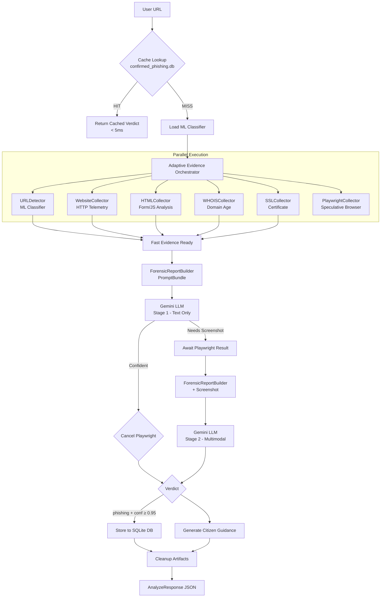

# CyberSathi 🛡️

**AI-powered phishing detection and citizen safety assistant powered by adaptive evidence collection and Gemini LLM reasoning.**

CyberSathi is a production-ready backend that combines a fine-tuned URL classifier, parallel multi-collector evidence gathering, and a multimodal LLM to detect phishing websites in real time — and generate actionable safety guidance for victims.

---

## Motivation

Phishing attacks are the single most common entry point for cybercrime in India and globally. Existing tools either:
- Rely solely on blocklists (miss zero-day phishing)
- Are too slow for real-time use (10–30 seconds per URL)
- Provide no citizen guidance after detection

CyberSathi solves all three problems:
- **Zero-day detection** via LLM forensic reasoning over live evidence
- **Sub-5 second responses** via adaptive speculative execution
- **Actionable citizen guidance** generated per-threat

---

## Key Features

- 🔍 **Adaptive Two-Stage LLM Reasoning** — Stage 1 uses fast evidence; Stage 2 adds visual screenshot only when needed
- ⚡ **Speculative Playwright Execution** — browser runs in background, cancelled if not needed (saves 7–10s)
- 🤖 **ML Pre-classification** — `urlbert-tiny-v4` model for instant URL risk scoring
- 📜 **5 Evidence Collectors** — Website, HTML, WHOIS, SSL, Playwright (browser)
- 🗄️ **SQLite Phishing Cache** — instant responses for re-analyzed known phishing URLs
- 🛡️ **Citizen Safety Guidance** — reporting portals, immediate actions, prevention tips
- 🔌 **FastAPI REST API** — production-ready with full OpenAPI documentation
- ✅ **22 passing unit tests**

---

## System Architecture

```
User URL
   │
   ▼
POST /api/v1/analyze
   │
   ▼
AnalysisService
   │
   ├─► confirmed_phishing.db (cache lookup)  →  Cache HIT? Return instantly
   │
   ├─► Load URLDetector ML model (lazy, once)
   │
   └─► EvidenceOrchestrator.execute_adaptive()
           │
           ├─► [PARALLEL] URLDetector.predict()      — URL ML classifier
           ├─► [PARALLEL] WebsiteCollector           — HTTP telemetry, redirects
           ├─► [PARALLEL] HTMLCollector              — form detection, JS analysis
           ├─► [PARALLEL] WHOISCollector             — domain age, registrar
           ├─► [PARALLEL] SSLCollector               — certificate details
           └─► [SPECULATIVE] PlaywrightCollector     — browser render + screenshot
           │
           ▼
       Fast Evidence Ready
           │
           ▼
       ForensicReportBuilder → PromptBundle (text + optional image)
           │
           ▼
       GeminiLLMAdapter.analyze_security()  ← Stage 1 LLM (text-only)
           │
           ├── Sufficient? → Cancel Playwright → Return verdict
           │
           └── Needs more? → Await Playwright screenshot
                             → GeminiLLMAdapter.analyze_security()  ← Stage 2 (multimodal)
           │
           ▼
       (if phishing / uncertain)
       GeminiLLMAdapter.generate_guidance()  ← Citizen safety guidance
           │
           ▼
       confirmed_phishing.db.insert()  (if verdict=phishing AND confidence ≥ 0.95)
           │
           ▼
       Cleanup artifacts (screenshots, HTML)
           │
           ▼
       AnalyzeResponse JSON
```

### Pipeline Diagram (Mermaid)



---

## Technology Stack

| Layer | Technology |
|-------|-----------|
| API Framework | FastAPI 0.139 + Uvicorn |
| Data Validation | Pydantic v2 + pydantic-settings |
| URL Classifier | `urlbert-tiny-v4` (HuggingFace Transformers + PyTorch) |
| Browser Automation | Playwright (Chromium headless) |
| HTML Parsing | BeautifulSoup4 |
| WHOIS Lookup | python-whois |
| LLM Provider | Google Gemini (`google-genai` SDK) |
| Image Handling | Pillow |
| Storage | SQLite (built-in) |
| HTTP Client | httpx + requests |

---

## Project Structure

```
cybersathi/
├── main.py                          # FastAPI application entry point
├── pyproject.toml                   # Project config and dependencies (uv)
├── requirements.txt                 # Production pip requirements
├── .env.example                     # Environment variables template
│
├── app/
│   ├── config/
│   │   └── config.py                # App-level configuration constants
│   ├── logging/
│   │   └── logger.py                # Structured logging setup
│   ├── models/
│   │   └── machine_learning.py      # URLDetector singleton (HuggingFace)
│   ├── prompts/
│   │   └── forensic_report_builder.py  # ForensicReportBuilder + PromptBundle
│   ├── routers/
│   │   └── analyze.py               # POST /api/v1/analyze endpoint
│   ├── schemas/
│   │   ├── analyze.py               # AnalyzeRequest / AnalyzeResponse
│   │   ├── evidence.py              # Evidence data models
│   │   └── safety.py                # ClassifierResult and legacy models
│   ├── services/
│   │   ├── analysis_service.py      # End-to-end orchestration
│   │   ├── collectors.py            # 5 evidence collectors
│   │   ├── evidence_builder.py      # Evidence model assembly
│   │   ├── evidence_orchestrator.py # Parallel + adaptive execution
│   │   ├── llm_adapter.py           # GeminiLLMAdapter (google-genai)
│   │   └── phishing_database.py     # ConfirmedPhishingDatabase (SQLite)
│   └── settings/
│       └── settings.py              # Pydantic settings from .env
│
├── scripts/
│   ├── demo_analyze.py              # CLI end-to-end demonstration
│   └── benchmark_e2e.py             # 5-URL full pipeline benchmark
│
├── tests/
│   ├── test_evidence_pipeline.py    # Orchestrator unit tests
│   ├── test_html_collector.py       # HTMLCollector unit tests
│   ├── test_playwright_collector.py # PlaywrightCollector unit tests
│   ├── test_url_detector.py         # URLDetector unit tests
│   └── test_website_collector.py   # WebsiteCollector unit tests
│
└── artifacts/
    ├── screenshots/                 # Transient (auto-cleaned after analysis)
    └── rendered_html/               # Transient (auto-cleaned after analysis)
```

---

## Installation

### Requirements

- Python 3.12+
- [`uv`](https://docs.astral.sh/uv/) (recommended) or pip
- Chromium (installed via Playwright)
- Google Gemini API key ([Get one free](https://aistudio.google.com/app/apikey))

### Setup

```bash
# 1. Clone the repository
git clone https://github.com/your-org/cybersathi.git
cd cybersathi

# 2. Install dependencies
uv sync
# or: pip install -r requirements.txt

# 3. Install Playwright browser
uv run playwright install chromium
# or: playwright install chromium

# 4. Configure environment
cp .env.example .env
# Edit .env and set GEMINI_API_KEY
```

---

## Environment Variables

| Variable | Required | Default | Description |
|----------|----------|---------|-------------|
| `GEMINI_API_KEY` | ✅ Yes | — | Google Gemini API key |
| `GEMINI_MODEL` | No | `gemini-2.0-flash` | Gemini model name |
| `LLM_TEMPERATURE` | No | `0.0` | LLM sampling temperature |
| `CLASSIFIER_MODEL_NAME` | No | `CrabInHoney/urlbert-tiny-v4-phishing-classifier` | HuggingFace model |
| `CLASSIFIER_THRESHOLD` | No | `0.75` | ML classifier confidence threshold |
| `PHISHING_DB_PATH` | No | `confirmed_phishing.db` | SQLite database path |
| `PHISHING_CONFIDENCE_THRESHOLD` | No | `0.95` | Minimum confidence to cache a phishing verdict |
| `PLAYWRIGHT_TIMEOUT_MS` | No | `15000` | Browser navigation timeout |
| `PLAYWRIGHT_HEADLESS` | No | `true` | Run browser headlessly |
| `HTTP_REQUEST_TIMEOUT_SEC` | No | `10` | HTTP collector timeout |
| `PORT` | No | `8000` | Server port |
| `LOG_LEVEL` | No | `INFO` | Logging level |

---

## Running the Backend

```bash
# Development (with auto-reload)
uv run uvicorn main:app --reload --host 0.0.0.0 --port 8000

# Production
uv run uvicorn main:app --host 0.0.0.0 --port 8000 --workers 1
```

> **Note:** Use `--workers 1` — the ML model and SQLite connection are process-level singletons.

**API docs available at:**
- Swagger UI: `http://localhost:8000/api/v1/docs`
- ReDoc: `http://localhost:8000/api/v1/redoc`

---

## API Documentation

### `POST /api/v1/analyze`

Analyzes a URL for phishing using the full adaptive pipeline.

**Request:**
```json
{
  "url": "https://example-suspicious.com",
  "bypass_cache": false
}
```

| Field | Type | Required | Description |
|-------|------|----------|-------------|
| `url` | string (URL) | ✅ Yes | Fully-qualified URL to inspect |
| `bypass_cache` | boolean | No | Skip local phishing DB cache |

**Response:**
```json
{
  "url": "https://example-suspicious.com",
  "verdict": "phishing",
  "confidence": 0.97,
  "severity": "critical",
  "cached": false,
  "impersonated_entity": "State Bank of India",
  "scam_category": "Banking Credential Phishing",
  "targeted_information": ["bank credentials", "OTP", "card number"],
  "key_evidence": [
    "Domain registered 3 days ago via anonymous registrar",
    "No SSL certificate from trusted CA",
    "Login form submits to external domain"
  ],
  "summary": "This site impersonates SBI Internet Banking...",
  "guidance": {
    "official_website": "https://www.onlinesbi.sbi",
    "reporting_authorities": [
      {
        "name": "Cyber Crime Portal (India)",
        "url": "https://cybercrime.gov.in",
        "reason": "Official government portal for reporting cybercrime in India"
      }
    ],
    "immediate_actions": [
      "Do NOT enter any credentials on this site",
      "If credentials were entered, change your SBI password immediately"
    ],
    "preventive_measures": [
      "Always verify the URL matches the official bank domain",
      "Enable SMS alerts on your bank account"
    ],
    "additional_advice": []
  },
  "timings": {
    "fast_evidence_latency_ms": 2100,
    "prompt1_latency_ms": 1800,
    "playwright_latency_ms": 0,
    "total_pipeline_latency_ms": 4150
  }
}
```

---

### `GET /api/v1/analyze/health`

Returns service health and database stats.

```bash
curl http://localhost:8000/api/v1/analyze/health
```

```json
{
  "status": "ok",
  "ml_model_loaded": true,
  "confirmed_phishing_db_records": 12
}
```

---

### `GET /health`

Root health check.

```bash
curl http://localhost:8000/health
```

---

### Example curl Commands

```bash
# Analyze a suspicious URL
curl -X POST http://localhost:8000/api/v1/analyze \
  -H "Content-Type: application/json" \
  -d '{"url": "https://suspicious-site.example.com"}'

# Analyze bypassing cache (force full re-analysis)
curl -X POST http://localhost:8000/api/v1/analyze \
  -H "Content-Type: application/json" \
  -d '{"url": "https://suspicious-site.example.com", "bypass_cache": true}'

# Health check
curl http://localhost:8000/api/v1/analyze/health
```

---

## CLI Demo

```bash
# Analyze default test URLs
uv run python scripts/demo_analyze.py

# Analyze specific URL
uv run python scripts/demo_analyze.py https://suspicious-site.com

# Force bypass cache
uv run python scripts/demo_analyze.py https://example.com --bypass-cache
```

---

## Adaptive Evidence Pipeline

The pipeline uses **speculative parallel execution** to minimize latency:

1. **All collectors start simultaneously** — Website, HTML, WHOIS, SSL, and Playwright run in parallel from the moment a request arrives.
2. **Fast Evidence Gate** — The system waits only for the 4 fast collectors (≤12s timeout) + ML classifier. This typically completes in 2–4 seconds.
3. **Stage 1 LLM** — The forensic report is submitted to Gemini with text-only evidence.
   - If confidence is **high** → Playwright task is **cancelled**. Saves 7–15 seconds.
   - If confidence is **low** → Playwright task is **awaited** (likely already done speculatively).
4. **Stage 2 LLM (optional)** — Rerun with the Playwright screenshot attached (multimodal).
5. **Guidance (optional)** — If verdict is phishing/uncertain and guidance is requested, Prompt 2 generates citizen safety information.

---

## URL Classifier

- **Model:** `CrabInHoney/urlbert-tiny-v4-phishing-classifier` (HuggingFace)
- **Architecture:** URLBert — BERT-based URL sequence classifier
- **Inference:** PyTorch with Apple MPS / CUDA / CPU support
- **Output:** `{label: "phishing"|"legitimate", probability, confidence, latency_ms}`
- **Role:** Fast initial signal (not final verdict). LLM always performs independent forensic analysis.

---

## LLM Reasoning

### Stage 1 — Security Analysis
- Input: ML score + WHOIS + SSL + HTML analysis + Website telemetry
- Output: `verdict`, `confidence`, `severity`, `key_evidence`, `requires_more_evidence`

### Stage 2 — Visual Analysis (Conditional)
- Input: All Stage 1 evidence + Playwright screenshot
- Output: Same schema, with visual evidence incorporated

### Prompt 2 — Citizen Guidance
- Input: Confirmed threat summary (impersonated entity, scam category)
- Output: `official_website`, `reporting_authorities`, `immediate_actions`, `preventive_measures`

---

## SQLite Confirmed Phishing Cache

**Insertion policy (strict):**
- `verdict == "phishing"` **AND** `confidence >= 0.95`
- Legitimate and uncertain verdicts are never stored

**Cache hit returns instantly** (<5ms) with stored verdict, confidence, and summary.

**Schema:**
```sql
CREATE TABLE confirmed_phishing (
    id            INTEGER PRIMARY KEY AUTOINCREMENT,
    url           TEXT    NOT NULL UNIQUE,
    domain        TEXT    NOT NULL,
    confidence    REAL    NOT NULL,
    severity      TEXT,
    impersonated  TEXT,
    scam_category TEXT,
    summary       TEXT,
    first_seen    TEXT    NOT NULL,
    last_seen     TEXT    NOT NULL,
    hit_count     INTEGER NOT NULL DEFAULT 1
);
```

---

## Running Tests

```bash
uv run pytest tests/ -v
```

All 22 tests should pass:
```
22 passed, 7 warnings in ~10s
```

---

## Future Improvements

- **Frontend:** React/Next.js web UI with real-time analysis results
- **API Authentication:** API key or OAuth for production deployment
- **Rate Limiting:** Per-IP request throttling
- **Bulk Analysis:** Batch endpoint for multiple URLs
- **Webhook Notifications:** Push alerts for high-confidence phishing
- **PhishTank Integration:** Cross-reference against community-verified database
- **DMARC/SPF Checks:** Email spoofing domain validation
- **Deployment:** Docker Compose + Kubernetes manifests

---

## License

MIT License — see [LICENSE](LICENSE) for details.

---

## Authors

Built at the **ET Hackathon** by Team CyberSathi.

---

## Acknowledgements

- [OpenPhish](https://openphish.com/) — Live phishing URL intelligence
- [HuggingFace](https://huggingface.co/) — Model hosting (URLBert)
- [Google Gemini](https://deepmind.google/technologies/gemini/) — LLM reasoning
- [Playwright](https://playwright.dev/) — Browser automation
- [FastAPI](https://fastapi.tiangolo.com/) — Web framework
